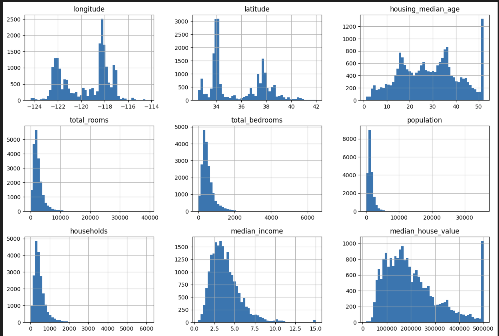
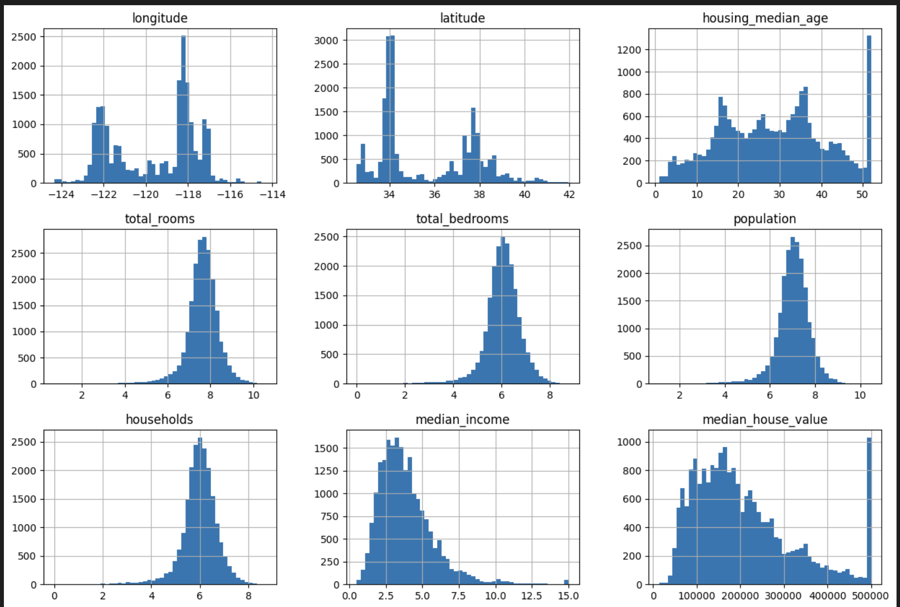
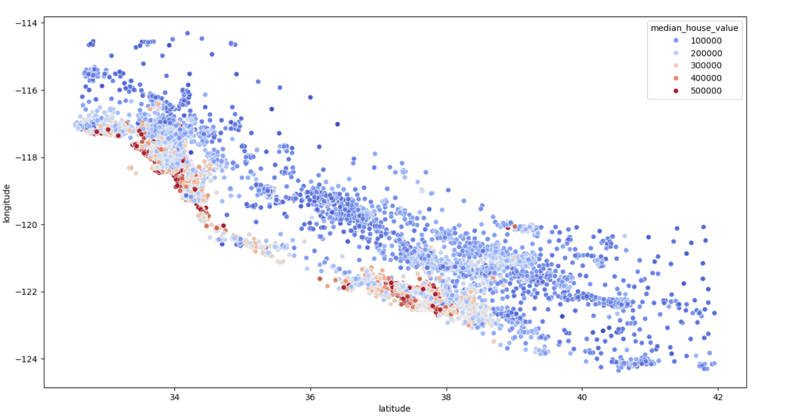
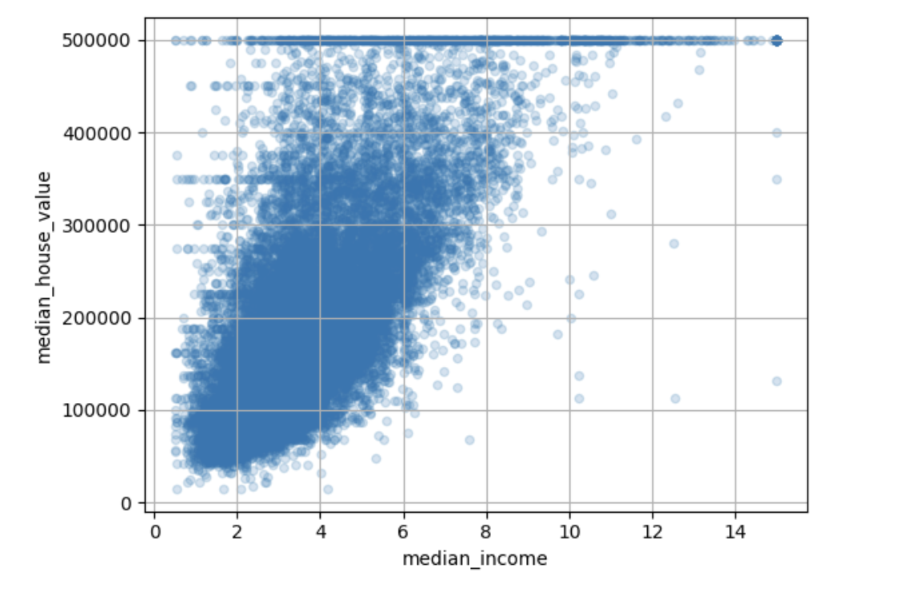
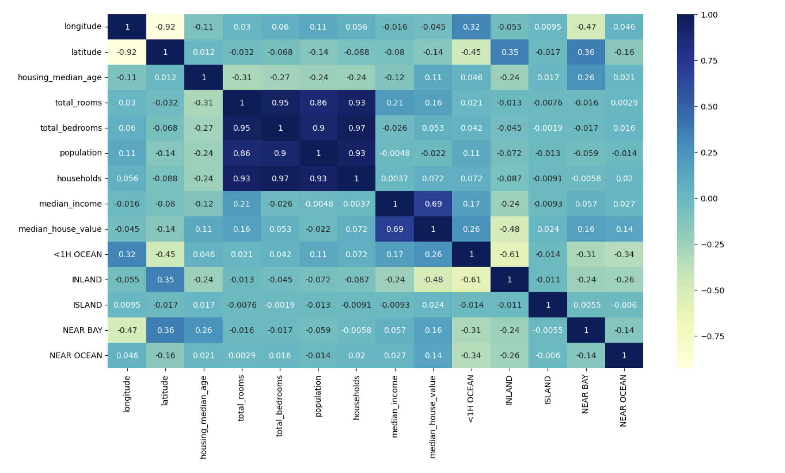

# Housing-Price-Prediction

## Overview
This project aims to predict price of house based on the a number of attribtues. It utilizes a dataset containing information about the latitude, longiture of house, the age of house, it's distanace from sea are and median income in that surrounding to train a model that can predict the salary of any arbitrary years of experience.

## Snaps
 

 

